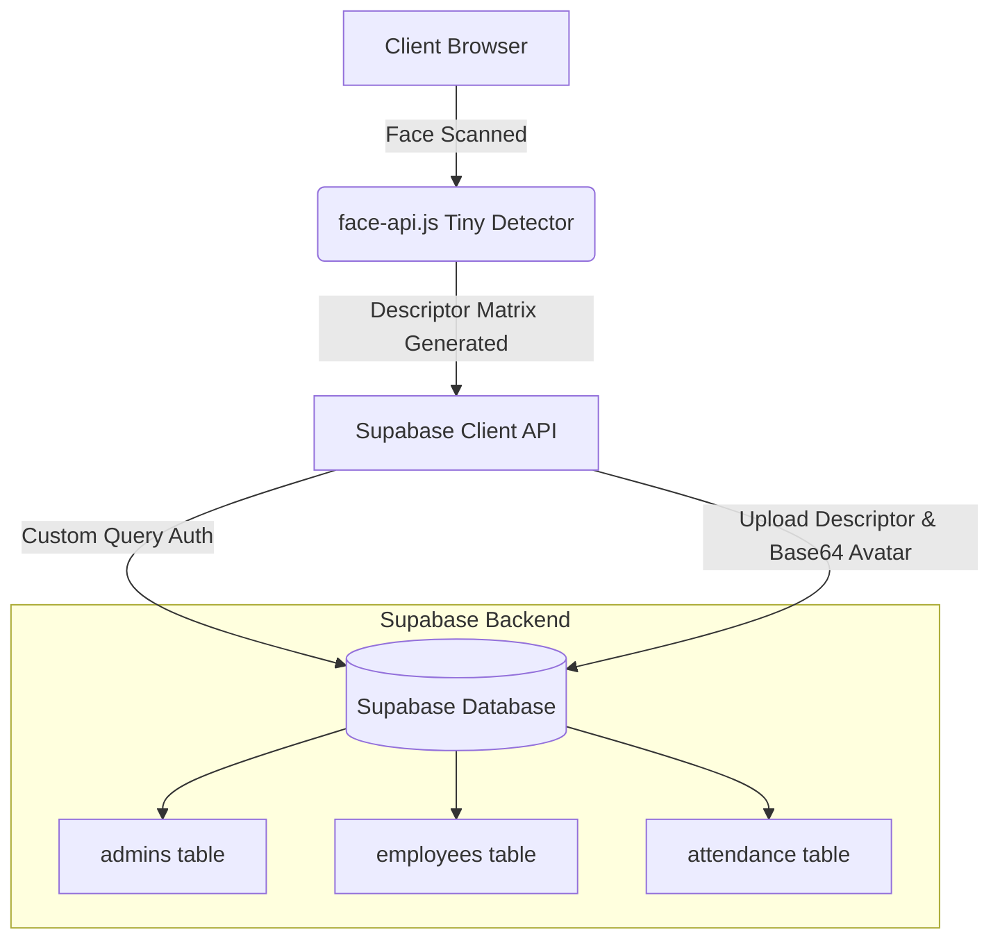

# FARAI - Face Attendance Recognition AI

FARAI is a premium, real-time employee attendance tracking application powered by facial recognition AI and a serverless Supabase backend. It delivers a fast, contactless, and highly secure clock-in/out portal for modern organizations.

---

## 🌟 Key Features

### 👤 Employee Experience
* **Biometric Enrollment:** 3D facial mapping and thumbnail registration directly in the portal using the device's camera.
* **Instant Verification:** Mark attendance in under 0.3 seconds using `face-api.js` Tiny Face Detector.
* **Shift Window Enforcement:** Prevents clock-in/out outside assigned schedule blocks.
* **Personal Portal:** View attendance history records, toggle themes (Light/Dark), filter history, and export CSV logs.

### 🔑 Admin Experience
* **Analytics Dashboard:** Live monitoring of present vs. absent employees, shift patterns, and real-time activity stream.
* **Employee Management:** Full CRUD operations for team members, department designations, and shift schedule parameters.
* **Dynamic Reports:** Search, filter, and export organization-wide daily/historical attendance sheets to CSV.

---

## 🏗️ System Architecture



---

## 🗄️ Database Schema

Run the following SQL DDL scripts in your Supabase SQL editor to set up the required table architecture:

### 1. `employees` Table
```sql
CREATE TABLE employees (
    id UUID PRIMARY KEY DEFAULT gen_random_uuid(),
    name TEXT NOT NULL,
    email TEXT NOT NULL UNIQUE,
    password TEXT NOT NULL,
    employee_id TEXT NOT NULL UNIQUE,
    department TEXT,
    designation TEXT,
    attendance_start_time TIME DEFAULT '09:00:00',
    attendance_end_time TIME DEFAULT '17:00:00',
    face_descriptor JSONB,
    face_image TEXT, -- Base64 encoded thumbnail URI
    created_at TIMESTAMPTZ DEFAULT now()
);
```

### 2. `admins` Table
```sql
CREATE TABLE admins (
    id UUID PRIMARY KEY DEFAULT gen_random_uuid(),
    name TEXT NOT NULL,
    email TEXT NOT NULL UNIQUE,
    password TEXT NOT NULL,
    created_at TIMESTAMPTZ DEFAULT now()
);
```

### 3. `attendance` Table
```sql
CREATE TABLE attendance (
    id BIGINT GENERATED BY DEFAULT AS IDENTITY PRIMARY KEY,
    employee_id UUID REFERENCES employees(id) ON DELETE CASCADE,
    date DATE NOT NULL DEFAULT CURRENT_DATE,
    login_time TIMESTAMPTZ NOT NULL DEFAULT now(),
    status TEXT NOT NULL CHECK (status IN ('Present', 'Absent', 'Late')),
    CONSTRAINT unique_daily_attendance UNIQUE (employee_id, date)
);
```

---

## 🛠️ Tech Stack

* **Frontend:** React 19, Vite 8, GSAP (animations)
* **Icons:** Lucide React
* **Charts:** Recharts
* **Face AI:** `face-api.js` (TensorFlow.js under the hood)
* **Backend & Storage:** Supabase Client

---

## 🚀 Local Quickstart

### 1. Clone & Install Dependencies
```bash
git clone https://github.com/vishnuvijayakumarofficial/FARAI_FaceAttendanceRecognition.git
cd FARAI_FaceAttendanceRecognition
npm install
```

### 2. Setup Environment Variables
Create a `.env` file in the project root:
```env
VITE_SUPABASE_URL=YOUR_SUPABASE_PROJECT_URL
VITE_SUPABASE_ANON_KEY=YOUR_SUPABASE_ANON_KEY
```

### 3. Download AI Model Weights
If you need to fetch the face-api models locally, run:
```bash
node downloadModels.cjs
```
This downloads the weights from GitHub into `public/models/`.

### 4. Run Development Server
```bash
npm run dev
```

### 5. Build for Production
```bash
npm run build
```
The compiled build output will be stored in `/dist`.

---

## 🛡️ License

Crafted with precision for the modern enterprise. All rights reserved.
